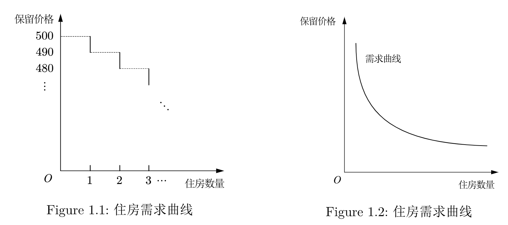
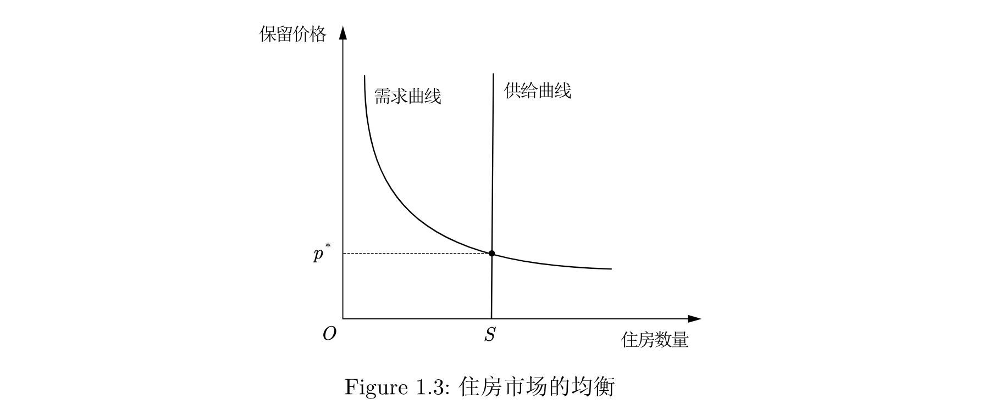
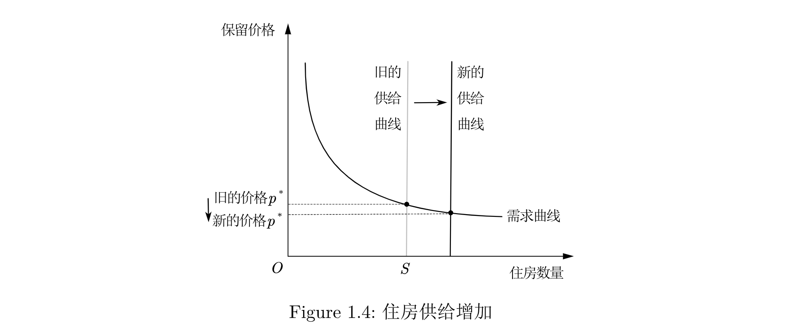

# Chapter 1: 市场

我们将主要使用 Varian, H. R. (2014) Intermediate Microeconomics: A Modern Approach. 9th ed. New York: W.W. Norton& Company.

经济学的研究 → **建立模型**. e.g. 美国中西部一个中等大小的大学城的住房市场. 邻近大学的住房在*内城区*, 其余的在*外城区*, 外城区的住房供应量很大, 价格固定在某个水平上, 我们只考察内城区住房价格的决定因素和谁将住在内城区. 我们说外城区的住房价格是**外生变量**, 内城区的住房价格是**内生变量**.

## 最优化与均衡

* 最优化原理: 人们总是选择他们能支付得起的最佳消费方式.
* 均衡原理: 价格会自行调整, 直到人们的需求数量与供给数量相等.
* 保留价格: 某人愿意支付的最高价格.
* 需求曲线: 一条把需求和价格联系起来的曲线.

如果一个人持有保留价格 $p$, 意味着他支付价格 $p$ 和住在外城区都是可以的, 因此按照价格 $p^*$ 出租的住房数量正好是所持保留价格大于或等于 $p^*$ 的人数, 画成下图 Figure 1.1:

由于存在大批需求者, 价格间的跳跃很小, 需求曲线的倾斜通常是平缓的, 如 Figure 1.2.

## 供给曲线

在**短期**内, 住房的数量多少是固定不变的. 当然, 如果是考虑**长期**的情况, 住房的数量必然随着建设或者某种别的因素增加或者减少.

## 市场均衡

我们用 $p^*$ 表示住房需求量等于住房供给量时的价格. 这就是住房的*均衡价格*. 在这个价格水平上, 愿意至少支付 $p^*$ 的消费者可以找到房子, 而每个房东也可以按照这个价格出租房子, 双方都没有理由改变他们的行为. 这就是我们所说的*均衡*, 即人们的行为不会有任何的变化. 正如下图 Figure 1.3.

## 比较静态分析

比较静态分析: 当市场各个方面发生变化的时候, 分析*均衡状态*的变动. p.s. *只关心两个“静态”均衡之间的比较, 而不关心市场是如何从一个均衡到另一个均衡的.*

现在我们先假设住房供给增加了:

从Figure 1.4中我们就能清楚地看到均衡价格将会下降.

现在, 假设有一个房地产开发商决定把一些公寓改造成个人所有的公寓, 那么其余住房的价格会有怎样的变动呢?

假设私人公寓的购买者已经居住在内城区, 也就是那些愿意支付高于 $p^*$ 价格的人, 那么假设有10个人决定购买住房, 那么住房的需求曲线就会向左移动10个单位, 同时供给曲线也会向左移动10个单位, 结果最后均衡价格就会保持不变.

现在, 假设对住房征税, 每个房东必须为他的房子支付一定比例的税. 那么当前的*住房供给不变*, 均衡价格 $p^*$ 已经是房东所能索取的最高价格了, 房东无法抬高住房价格, 所以税收必须由房东来支付.

## 配置住房的其他方法

* 垄断: 市场被某一产品的单一卖主所支配的情况.
* 价格歧视垄断者: 只有一个占支配地位的房东, 他拥有所有的住房. 他可以按不同的价格出租房子. p.s. *他会按照保留价格从高到低出售给消费者, 使得最后一个人支付 $p^*$, 从 $0$ 到 $p^*$ 和需求曲线围起来的面积就是房东的收益.*
* 一般垄断者: 他被迫按照同样的价格出租每一套房子. *设垄断者定价为 $p$, 此时的需求为 $D(p)$, 那么收益就是 $p D(p)$, 他应该在这个式子取最大值时定价.*
* 房租管制: 制定了房租的最高值为 $p_{\text{max}}$.

## 帕累托效率

* 帕累托改进: 如果可以找到一种配置方法, 在**其他人的境况没有变坏**的情况下, 的确能够**使得一些人的境况变得更好**一点, 那么就存在*帕累托改进*.
* 帕累托低效率: 如果一种配置方法存在*帕累托改进*, 那么它就被称为*帕累托低效率*的.
* 帕累托有效率: 如果一种配置方法不存在任何的*帕累托改进*, 那么它就被称为*帕累托有效率*的.

## 配置住房的不同方法的比较

任何一个拥有内城区住房的人一定要比拥有一套外城区住房的人持有一个更高的保留价格. *否则*, 他俩可以交易使得双方的境况都变好, 违反了*帕累托有效率*配置.

竞争市场, 价格歧视垄断者 → 帕累托有效率的.

一般垄断者, 房租管制 → 帕累托低效率的.

## 长期均衡

住房的供给不再固定不变.