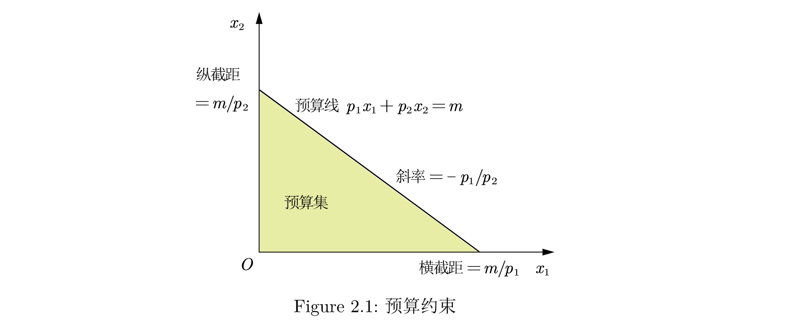
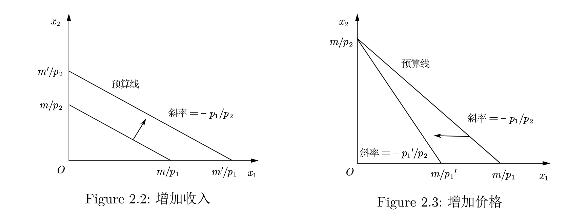

# Chapter 2: 预算约束

# 预算约束

* 消费束: $X \equiv (x_1, x_2)$ 表示消费者选择商品 $x_1$ 的消费量和 $x_2$ 的消费量. p.s. *两种商品的概括性很强, 因为我们可以把另外的一种商品看成是消费者想要消费的其他一切商品的总和, 代表了一种复合商品*.
* 预算约束: 假设我们知道了两种商品的价格 $(p_1,p_2)$ 以及消费者要花的货币总数 $m$, 那么预算约束就可以被写为
  $$
  p_1 x_1 + p_2 x_2 <= m.
  $$
* 预算集: 我们把当价格为 $(p_1,p_2)$ 和收入为 $m$ 时能够负担的消费束称为消费者的*预算集*.
* 预算线: *预算线*指的是所需费用正好等于 $m$ 的一系列消费束, 即 
  $$ 
  p_1 x_1 + p_2 x_2 = m. 
  $$

下面是预算约束的图示

## 预算线的变动

- 增加收入: 当收入增加时, 预算线向外移动, 但是斜率不变, 如 Figure 2.2.
- 增加价格1: 预算线向内移动, 斜率绝对值变大, 斜率变小, 如 Figure 2.3.

## 计价物

我们可以把其中一个商品或者收入看成1, 如果把一个商品价格看成1, 那么他的价格就被称为*计价物*(numeraire)价格.

## 税收、补贴和配给

+ **从量税**: Quantity tax, 也称*消费税*, 消费者购买每单位商品都需要向政府缴纳一定的税收. *对每1单位商品征收 $t$ 美元从量税, 会导致商品价格从 $p$ 变为 $p+t$*.
+ **从价税**: Value tax, Ad valorem tax, *销售税*, 对商品的价格征税, 通常用百分比表示. *对商品征收 $\tau$ 的从价税, 会导致商品价格从 $p$ 变为 $(1+\tau)p$*.
+ **所得税**: Income tax, 对收入征税. 导致收入变少.
+ **从量补贴**: 根据消费者购买商品的数量给予补贴.
+ 从价补贴: 根据商品的价格给予补贴.
+ 总额税: 不管消费者的行为如何, 政府总要取走一笔固定金额的货币.
+ 总额补贴: 不管消费者的行为如何, 政府总要给予一笔固定金额的货币.
+ 配给供应: Rationing, 限制消费者购买商品的数量.