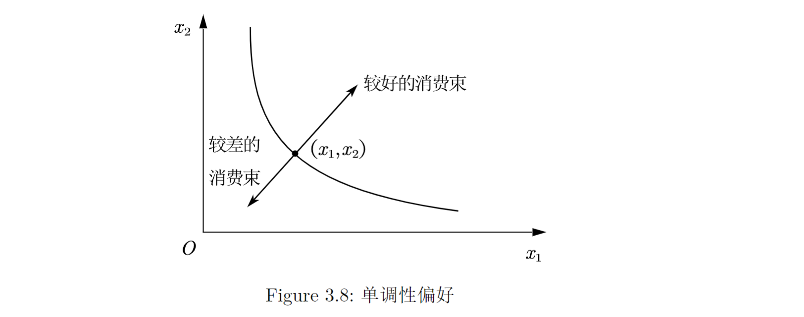

# Chapter 3: 偏好

## 消费者偏好

+ **严格偏好**: $(x_1,x_2) \succ (y_1,y_2)$ 表示对于消费者来说 $(x_1,x_2)$ 严格偏好于 $(y_1,y_2)$. *偏好这个概念是建立在消费者行为基础上的*.
+ **无差异**: $(x_1,x_2) \sim (y_1,y_2)$表示两个消费束使得消费者获得的满足程度完全一样.
+ **弱偏好**: 消费者在两个消费束之间有偏好或者无差异, 表示为 $(x_1,x_2) \succeq (y_1,y_2)$.

## 关于偏好的几种假设

关于消费者偏好的三条公理:
1. **完备性公理**: 假定任何两个消费束之间都是可以比较的. 也就是说, 要么有 $(x_1,x_2) \succeq (y_1,y_2)$ 或 $(y_1,y_2) \succeq (x_1,x_2)$ 或两者都有, 最后一种情况就说明消费者对这两个消费束是无差异的.
2. **反身性公理**: 假定任何消费束至少是与本身一样好的. 也就是说, $(x_1,x_2) \succeq (x_1,x_2)$.
3. **传递性公理**: 假定如果 $(x_1,x_2) \succeq (y_1,y_2)$ 且 $(y_1,y_2) \succeq (z_1,z_2)$, 那么 $(x_1,x_2) \succeq (z_1,z_2)$.

## 无差异曲线

+ 无差异曲线: 和 $(x_1,x_2)$ 无差异的消费束.
+ 弱偏好集: 弱偏好于 $(x_1,x_2)$ 的所有消费束的集合.

如图Figure 3.1 所示, 无差异曲线和弱偏好集.

注意, 无差异曲线之间不能相交. 我们先在每条无差异曲线上选择一个消费束, 分别记为 $X$ 和 $Y$, 然后再选择他们的交点 $Z$, 我们不妨设 $X \succ Y$, 同时注意到 $X \sim Z$, $Y \sim Z$, 这就会导出 $X \sim Y$, 这是和 $X \succ Y$矛盾的.

## 偏好的实例

对于某个点 $(x_1,x_2)$, 现在考虑给消费者增加一点商品1, 即 $\Delta x_1$, 现在考虑: 为了使得现在的消费束和之前的消费束无差异, 应该如何变动 $x_2$? 也就是求出 $\Delta x_2$, 使得 $(x_1+\Delta x_1,x_2+\Delta x_2) \sim (x_1,x_2)$.

### 完全替代品

**完全替代品**: 消费者愿意按固定的比率用一种商品替换另一种商品. 比如, 消费者愿意用 $t$ 单位商品2来替换1单位商品1, 那么无差异曲线的斜率就为 $-t$.

在Figure 3.2中, 不同的无差异曲线分别代表不同的偏好. 但是他们的斜率都是 $-t$.

### 完全互补品

**完全互补品**: 始终以固定的比例一起消费的商品. 比如鞋子, 必须要一只左脚一只右脚, 然后你无论怎么增加右脚的数量, 都不会让消费者的效用增加, 也就是$(1,1) \sim (1, x), x > 1$.

因此, 无差异曲线将是一条L型曲线, 正如Figure 3.3 所示. 

### 厌恶品

**厌恶品**: 消费者所不喜欢的商品. 增加厌恶品, 反而会导致消费者的效用下降. 也就是在增加 $x_1$ 的同时, 必须同时增加 $x_2$ 来补偿消费者的效用下降.

因此, 存在厌恶品的无差异曲线的斜率必然为正, 如Figure 3.4 所示.

### 中性商品

**中性商品**: 无论数量怎么增加, 消费者都毫不在乎. 比如 $x_1$ 是中性商品, 那么$(x_1, x_2) \sim (x_1', x_2),\forall x_1'$. 

此时的无差异曲线是一条垂直线, 如Figure 3.5 所示.

### 魇足

*魇足*: 对于消费者来说有一个最佳的消费束, 越靠近这个消费束越好. 比如, 有一个消费者最偏爱的消费束 $(\bar{x}_1, \bar{x}_2)$, 离这个消费束越远, 他的情况就越糟. 那么这个点就是一个*魇足点*或者*最佳点*. 如Figure: 3.6 所示.

### 离散商品

**离散商品**: 只能以整数量获得的商品. 我们要求出 $x_1=0$ 的时候 $x_2$ 在对应偏好下的取值, $x_1=1$ 的时候 $x_2$ 在对应偏好下的取值, $x_1=2$ 的时候 $x_2$ 在对应偏好下的取值, ..., $x_1=n$ 的时候 $x_2$ 在对应偏好下的取值. 然后把这些点连接起来.

而为了求出弱偏好集, 实际上就是在对应的整数 $x_1$ 下, 所有的 $(x_1,x_2), x_2 \geq x_2^\text{corresponding}$. 实际上一条无差异曲线应该是一堆 $x_1$ 为*整数*的点的集合, 如Figure 3.7(a). 而弱偏好集则是一堆垂直的线条的集合, 如Figure 3.7(b).

选择是否强调一种商品的离散性取决于我们的应用. 比如消费者一般就选择1个或者2个单位的商品, 那么离散性很重要. 但是选择的商品数量很大, 离散型就没有那么重要了.

## 良态偏好

*良态无差异曲线的*的定义性特征:
1. 就商品(goods)而不是厌恶品(bads)而言, 人们认为多多益善. 这个假设也被称为偏好的*单调性*. 也就是说, 假设 $(x_1,x_2)$ 是一个由正常商品组成的消费束, $(y_1,y_2)$ 是一个满足 $y_1 \geq x_1, y_2 \geq x_2$ 且两者不能均取等的消费束, 那么 $(y_1,y_2) \succ (x_1,x_2)$. → 无差异曲线的斜率必须是负的. 如Figure 3.8所示.

2. 平均消费束比端点消费束更受偏好. 也就是我们假定: 如果 $(x_1,x_2) \sim (y_1, y_2)$, 那么对于任何的 $t \in [0,1]$, 有: 
$$ 
(t x_1 + (1-t) y_1, t x_2 + (1-t) y_2) \succeq (x_1,x_2). 
$$

这件事在几何上的解释意味着弱偏好于 $(x_1,x_2)$ 的所有消费束的集合是一个*凸集*. 换句话说, $(x_1,x_2)$ 和 $(y_1,y_2)$ 的所有*加权平均消费束*都弱偏好于 $(x_1,x_2)$ 和 $(y_1,y_2)$.

> 凸集具有这样的特征, 即我们如果在集上任取两个点, 则它们的连线段完全在集内. Figure 3.9给出了各种偏好.

*严格凸*的, 把上面关于凸集的定义中的弱偏好于改造成严格偏好于, 凸偏好的无差异曲线可能有平坦的部分, 但是严格凸偏好的无差异曲线不存在平坦部分. 

完全替代商品的偏好是凸的, 但**不是**严格凸的.

## 边际替代率

**边际替代率**: 无差异曲线的斜率, marginal rate of substitution, MRS. → 边际替代率一般是负数. 计算公式: 
$$ 
\text{MRS} = \frac{\Delta x_2}{\Delta x_1}. 
$$

假设消费者具有良态偏好, 也就是说, 消费者的偏好是单调的、凸的, 现在提供一次交换商品的机会, 按照某个交换率 $E$ 来交换, 也就是消费者放弃 $\Delta x_1$ 单位的商品1, 他可以得到 $E \Delta x_1$ 单位的商品2. 那么这就意味着消费者可以沿着一条斜率为 $-E$ 的直线移动.

→ 现在问: 为了让消费者保持在$(x_1,x_2)$这个消费束上不动, 这个交换率应该是多少?

→ 那么这就意味着这条直线上的点不能出现在这条无差异曲线的上方, 否则我们就可以从上方的消费束中选择一个, 使得消费者对这个消费束有更强的偏好.

→ 这也就意味着这条直线和无差异曲线在这点相切, $-E=\text{MRS}, E=-\text{MRS}$, Figure 3.10说明了这点.

**边际消费意愿**: 为了多消费一点商品1而愿意放弃的美元数. 我们只需要把商品2看成美元即可.