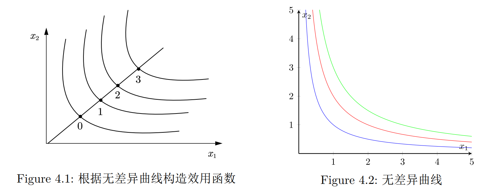

# 效用

```admonish note title="效用函数"
为每个可能的消费束指定一个数字, 使得受较多偏好的消费束的数字大于指派给受较少偏好的消费束的数字. p.s. 这也就意味着, $(x_1,x_2) \succ (y_1,y_2)$ 当且仅当 $u(x_1,x_2)>u(y_1,y_2)$.
```

```admonish note title="单调变换"
单调变换: 保持数字次序不变的方式将一组数字变换成另一组数字.
```

```admonish tip
一个效用函数的单调变换还是一个效用函数, 这个效用函数代表的偏好与原效用函数代表的偏好相同.
```

## 基数效用

```admonish note title="基数效用"
基数效用: 效用的数值具有重要意义.
```

## 构造效用函数

**根据无差异曲线构造效用函数**: 画一条如Figure 4.1的对角线, 沿着这条线测度每条无差异曲线离原点的距离, 并且以此标记每条无差异曲线. 只要偏好是单调的, 我们就可以说明这是一个效用函数.

**由效用函数推出无差异曲线**: 我们假设效用函数为 $u(x_1,x_2)=x_1 x_2$. 那么无差异曲线就是使得 $k=x_1 x_2$ 的所有 $x_1$ 和 $x_2$ 的组合. → 无差异曲线满足公式
$$ 
x_1 = \frac{k}{x_2}. 
$$
Figure 4.2中的三条无差异曲线就分别是 $k=1,2,3$ 的情况.



### 完全替代偏好

**完全替代偏好**: 一般地, 完全替代偏好可以使用以下形式的效用函数来描述: 
$$ u(x_1,x_2)=a x_1 + b x_2. $$

### 完全互补偏好

**完全互补偏好**: 一般地, 完全互补偏好可以使用以下形式的效用函数来描述: $$ u(x_1,x_2)= \min\{ a x_1, b x_2 \}. $$

### 拟线性偏好

**拟线性偏好**: 效用函数对商品2来说是线性的: $$ u(x_1,x_2)=v(x_1) + x_2. $$

### 柯布-道格拉斯偏好

```admonish note title="柯布-道格拉斯效用函数"
$$ u(x_1,x_2) = x_1^c x_2^d. $$
其中, $c$ 和 $d$ 都是描述消费者偏好的正数. 它可以被变形为: $$ v(x_1, x_2) = \ln(x_1^c x_2^d) = c \ln x_1 + d \ln x_2. $$
也可以被变形为: $$ v(x_1, x_2) = (x_1^c x_2^d)^{\frac{1}{c+d}} = x_1^{\frac{c}{c+d}} x_2^{\frac{d}{c+d}} = x_1^a x_2^{1-a}. $$ 这里的 $a = c/(c+d)$.
```

## 边际效用

商品1的边际效用: marginal utility of good 1. 

被定义为: $$ \text{MU}_1 = \frac{\Delta U}{\Delta x_1} =\frac{u(x_1+\Delta x_1, x_2) - u(x_1, x_2)}{\Delta x_1}. $$
或者是某种微积分的定义形式:
$$
  \text{MU}_1=\lim_{\Delta x_1 \to 0} \frac{u(x_1+\Delta x_1, x_2)-u(x_1,x_2)}{\Delta x_1}  = \frac{\partial u(x_1,x_2)}{\partial x_1}.
$$

我们可以发现: $$ \text{MU}_1 \Delta x_1 + \text{MU}_2 \Delta x_2 = \Delta U = 0. $$
根据这个式子, 我们将会推导得到: $$ \text{MRS} = \frac{\Delta x_2}{\Delta x_1}= - \frac{\text{MU}_1}{\text{MU}_2}. $$

## 通勤车票的效用

我们假设 $(x_1,x_2,...,x_n)$ 表示自己驾车时的对应的$n$个特征的值, $(y_1,y_2,...,y_n)$ 表示坐公交时的对应的$n$个特征的值. 我们设效用函数表示为: $ U(x_1,x_2,...,x_n) = \beta_1 x_1 + \beta_2 x_2 + ... + \beta_n x_n. $

$\beta_i$ 表示各种特征的**边际效用**, 两个系数之间的比率, 表示一个特征和另一个特征之间的**边际替代率**. e.g. $$ \frac{\beta_1}{\beta_2} = \frac{\text{MU}_1}{\text{MU}_2}= -\text{MRS}. $$
这是说, 要是能减少1单位的特征1, 消费者宁愿增加 $\text{MRS}$ 个单位的特征2.

## 微分表达形式

**方法一**: 根据 $\text{MU}$ 的计算, 我们知道: 
$$ 
\mathrm{d}u = \frac{\partial u(x_1,x_2)}{\partial x_1} \mathrm{d}x_1 + \frac{\partial u(x_1,x_2)}{\partial x_2} \mathrm{d}x_2 = 0. 
$$ 
这样我们就会得到: 
$$ 
\text{MRS} = \frac{\mathrm{d}x_2}{\mathrm{d}x_2} = - \frac{\frac{\partial u(x_1,x_2)}{\partial x_1}}{\frac{\partial u(x_1,x_2)}{\partial x_2}}.
$$

**方法二**: 把 $x_2$ 视作 $x_1$ 的函数 $x_2 (x_1)$, 那么有: 
$$ u(x_1,x_2(x_1)) \equiv k. $$
对于这个式子两边同时对$x_1$求微分得到: 
$$ 
\frac{\partial u(x_1,x_2)}{\partial x_1} + \frac{\partial u(x_1,x_2)}{\partial x_2} \frac{\partial x_2 (x_1)}{\partial x_1} = 0. 
$$
这个方程将会得到: 
$$ 
\text{MRS} = \frac{\partial x_2 (x_1)}{\partial x_1} = - \frac{\frac{\partial u(x_1,x_2)}{\partial x_1}}{\frac{\partial u(x_1,x_2)}{\partial x_2}}. 
$$

**边际替代率与效用的表示方法无关**, 因为作单调变换 $f(u)$ 后得到 $\frac{\partial f}{\partial u}$ 可以消去.

<span style="color: red">单调变换不可能改变边际替代率.</span>

**柯布-道格拉斯偏好**: 
+ 选择对数表达式: 
$$ 
\text{MRS} = - \frac{c/x_1}{d/x_2} = - \frac{c x_2}{d x_1}. 
$$
+ 选择指数表达式: 
$$ 
\text{MRS} = - \frac{c x_1^{c-1}x_2^d}{d x_1^c x_2^{d-1}} = - \frac{c x_2}{d x_1}. 
$$
