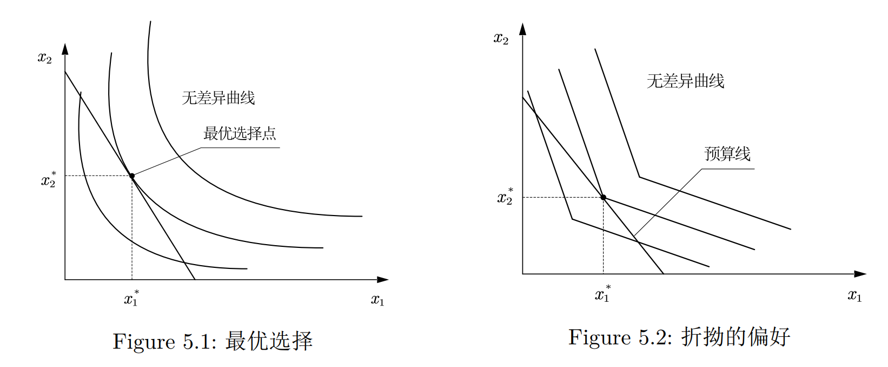
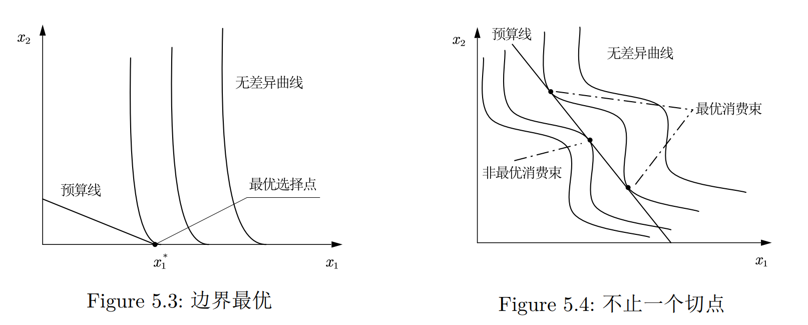

# Chapter 5: 选择

消费者从他们的预算集中选择最偏好的消费束.

## 最优选择

预算线与无差异曲线相切的消费束是消费者的**最优选择**, 记为 $(x_1^*,x_2^*)$. 如Figure 5.1所示.

但是最优选择并不是一定意味着相切.
+ 无差异曲线没有切线. 但是却有一个折点. 这种情况没有多少经济学含义, 如Figure 5.2.
+ 最优选择出现在某些商品为0的情况. 虽然斜率不同, 但是无差异曲线没有穿过预算线, 比如Figure 5.3. 这代表一个**边界最优**, 而Figure 5.1则代表一个**内部最优**.
+ 而且相切也不一定最优, 比如Figure 5.4.

内部最优点上, 一定有: $$ \text{MRS} = - \frac{p_1}{p_2}. $$我们可以发现预算约束线的斜率实际上代表了两种商品的交换比率.

## 消费者需求

**需求束**: 一定价格和收入水平下商品1和商品2的最优选择, 被称为消费者的**需求束**.

**需求函数**: 需求函数是将最优选择(也就是需求数量)与不同的价格和收入值联系起来的函数. 我们可以把需求函数记为 $x_1 (p_1, p_2, m)$ 和 $x_2 (p_1, p_2, m)$.

### 完全替代

那么消费者应该去买便宜的那一种. 所以商品1的需求函数为:
$$
x_1 = \begin{cases}
    m / p_1, &\text{ if } p_1 < p_2, \\
    \text{any value between } 0 \text{ and } m / p_1, &\text{ if } p_1 = p_2, \\
    0, &\text{ if } p_1 > p_2.
\end{cases}
$$

### 完全互补

最优选择应该总是出现在对角线上. e.g. 应该成对地买鞋. 
$$ 
x_1 = x_2 = \frac{m}{p_1+p_2}. 
$$

### 中性商品和厌恶品

消费者应该会把所有的钱购买他喜爱的商品, 所以这两类商品的需求都为0.

### 离散商品

分别比较 $(0,m)$, $(1,m-p_1)$, $(2,m- 2 p_1)$, ...来判断哪个消费束的效用最高. 我们这里假设商品2是美元, 而商品1是只能以整数单位获得的商品.